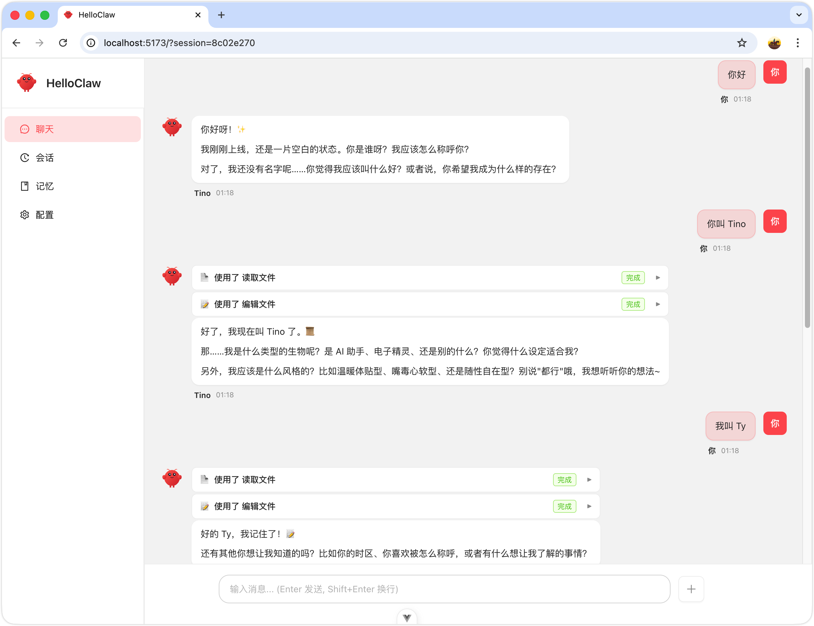

# HelloClaw

> 基于 HelloAgents 框架的个性化 AI Agent 平台

## 图示



## 核心特性

- 🎭 **可定制身份** - Markdown 配置 Agent 的身份、性格、行为规则
- 🧠 **多层次记忆** - 会话/每日/长期记忆，自动捕获、分类、去重
- 🛠️ **工具系统** - 文件操作、计算器、记忆管理
- 🔌 **多渠道** - Web UI + CLI
- 🤖 **子 Agent** - 任务委托，上下文隔离

## 快速开始

```bash
# 后端
cd backend && uv sync && uv run uvicorn src.main:app --reload --port 8000

# 前端
cd frontend && pnpm install && pnpm dev
```

访问 http://localhost:5173

## 技术栈

- **后端**: Python 3.10+ / FastAPI / HelloAgents
- **前端**: Vue 3 / TypeScript / Ant Design Vue
- **LLM**: OpenAI 兼容接口（GLM/DeepSeek/Qwen）

## 里程碑

| 里程碑 | 功能 | 状态 |
|--------|------|------|
| M1 | 项目骨架 | ✅ |
| M2 | Agent 配置系统 | ✅ |
| M3 | 记忆系统 | ✅ |
| M4 | 工具系统 | 🚧 |
| M5 | 子 Agent 系统 | ⏳ |
| M6 | Web 渠道 | ⏳ |
| M7 | CLI 渠道 | ⏳ |
| M8 | 完善 | ⏳ |

## 文档

- [功能详解](docs/features.md)
- [记忆系统](docs/memory-system.md)
- [API 文档](docs/api.md)

## 致谢

- [HelloAgents](https://github.com/helloagents/helloagents)
- [OpenClaw](https://github.com/openclaw/openclaw)

## License

MIT
